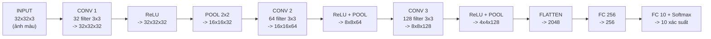
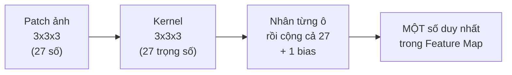
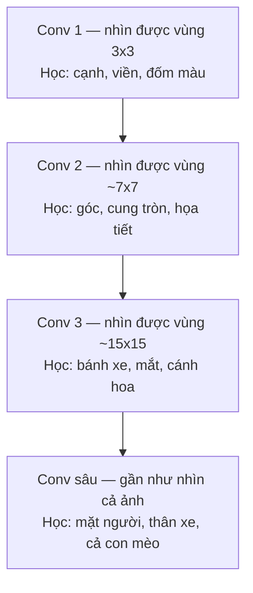

# CNN

> 🎓 **NCKH** / **Deep Learning** / **CNN**

## Tổng quan

**CNN (Convolutional Neural Network — Mạng nơ-ron tích chập)** là kiến trúc mạng nơ-ron sâu chuyên xử lý dữ liệu có cấu trúc **dạng lưới (grid-like)** — điển hình nhất là **ảnh**, vốn là một lưới 2 chiều các giá trị pixel. Đây là nền tảng của hầu hết các mô hình Computer Vision hiện đại.

### Vì sao không dùng thẳng mạng Dense cho ảnh?

Giả sử một ảnh màu 32×32, tức 32 × 32 × 3 = **3072** số. Nếu nối thẳng vào một lớp Dense có 3072 nơ-ron:

$$3072 \times 3072 \approx 9{,}44 \text{ triệu tham số — chỉ cho MỘT lớp}$$

Trong khi đó một lớp tích chập 3×3 với 32 filter chỉ cần **896 tham số** (sẽ tính chi tiết ở mục 8). Chênh nhau hơn **10.000 lần**.

> 🔑 **Ba ý tưởng làm nên CNN — và cũng là ba lý do nó tiết kiệm tham số:**
> **1. Kết nối cục bộ (local connectivity).** Mỗi nơ-ron chỉ "nhìn" một ô vuông nhỏ 3×3 hoặc 5×5, không nhìn toàn ảnh. Hợp lý, vì một cái cạnh chỉ cần vài pixel lân cận là nhận ra được.
>
> **2. Chia sẻ trọng số (weight sharing).** Cùng **một** bộ lọc được trượt khắp bức ảnh. Bộ lọc dò cạnh dọc ở góc trên trái cũng chính là bộ lọc dò cạnh dọc ở góc dưới phải.
>
> **3. Bất biến theo vị trí (translation invariance).** Nhờ hai ý trên, con mèo nằm ở góc trái hay góc phải đều được nhận ra như nhau.
>

> 💡 **Trực giác dễ nhớ:** hãy tưởng tượng bạn có một **tấm kính lúp in sẵn hoa văn** (đó là kernel) và bạn **trượt nó khắp bức ảnh**. Ở chỗ nào hoa văn trên kính khớp với hoa văn trong ảnh, kính sẽ **sáng lên**. Bản ghi lại "chỗ nào sáng, chỗ nào tối" chính là **Feature Map**.
> Một CNN chỉ đơn giản là: có **nhiều tấm kính lúp** như vậy (nhiều filter), và **xếp chồng nhiều tầng kính** — tầng sau soi lên kết quả của tầng trước.
>

---

## Toàn cảnh: một tấm ảnh đi qua CNN như thế nào



> 👁️ **Quy luật xuyên suốt cả sơ đồ — đọc hai con số này là hiểu toàn bộ CNN:**
> **Chiều không gian (rộng × cao) GIẢM DẦN:** 32 → 16 → 8 → 4
>
> **Chiều sâu (số kênh) TĂNG DẦN:** 3 → 32 → 64 → 128
>
> Nghĩa là mạng đang **đánh đổi "ở đâu" lấy "là cái gì"**. Lúc đầu nó biết rất rõ từng pixel nằm ở đâu nhưng không biết đó là gì; càng về sau nó càng biết rõ "đây là tai mèo" nhưng chỉ còn biết vị trí một cách mơ hồ.
>

---

## Đọc hiểu một tensor: đầu vào và đầu ra thực sự là gì?

Trước khi đi vào từng lớp, phải nắm chắc một điều: **mọi thứ chạy trong CNN đều là tensor 3 chiều** $H \times W \times C$ (cao × rộng × số kênh). Đầu vào của một lớp là một tensor, đầu ra cũng là một tensor.

| Tensor | Kích thước | Ý nghĩa của "kênh" (C) |
| --- | --- | --- |
| Ảnh xám gốc | 28 × 28 × **1** | 1 kênh = độ sáng |
| Ảnh màu gốc | 32 × 32 × **3** | 3 kênh = Đỏ, Lục, Lam (RGB) |
| Sau Conv 1 (32 filter) | 32 × 32 × **32** | 32 kênh = **32 loại đặc trưng** khác nhau (cạnh dọc, cạnh ngang, đốm sáng...) |
| Sau Conv 3 (128 filter) | 4 × 4 × **128** | 128 kênh = 128 khái niệm trừu tượng (mắt, bánh xe, lông...) |

> ⚠️ **Chỗ người mới hay nhầm nhất:** sau lớp Conv đầu tiên, chữ "kênh" **không còn nghĩa là màu sắc nữa**. Kênh thứ 7 của Feature Map không phải một màu — nó là **bản đồ trả lời câu hỏi "filter số 7 khớp mạnh ở những chỗ nào trong ảnh"**.
> Số kênh của đầu ra **luôn bằng số filter** của lớp Conv đó. Đây là quy tắc quan trọng nhất cần nhớ.
>

---

## Chi tiết từng lớp

Mỗi mục dưới đây theo đúng một khuôn mẫu: **đầu vào là gì → lớp làm gì → đầu ra là gì**.

### Lớp 0 — Input Layer (Lớp đầu vào)

| Mục | Nội dung |
| --- | --- |
| **Đầu vào** | Một file ảnh (JPG, PNG...) |
| **Việc phải làm** | Đổi ảnh thành ma trận số; chuẩn hóa pixel từ 0–255 về đoạn [0, 1] hoặc [−1, 1]; gom nhiều ảnh thành một batch |
| **Đầu ra** | Tensor $N \times H \times W \times C$ — ví dụ 64 × 32 × 32 × 3 (64 ảnh màu 32×32) |
| **Tham số học được** | **0** — lớp này không học gì cả |

> 📏 **Vì sao phải chuẩn hóa?** Pixel gốc chạy từ 0 đến 255. Đưa thẳng những con số lớn như vậy vào mạng sẽ làm gradient rất lớn và huấn luyện mất ổn định. Chia cho 255 là bước bắt buộc, gần như không tutorial nào bỏ qua.
> Trong PyTorch, thứ tự chiều là $N \times C \times H \times W$ (kênh đứng trước), còn TensorFlow/Keras dùng $N \times H \times W \times C$. Đây là nguồn lỗi shape rất hay gặp khi chuyển code giữa hai thư viện.
>

### Lớp 1 — Convolutional Layer (Lớp tích chập)

Đây là **lớp cốt lõi**, nơi việc học thật sự diễn ra.

| Mục | Nội dung |
| --- | --- |
| **Đầu vào** | Tensor $H_{in} \times W_{in} \times C_{in}$ — ví dụ 32 × 32 × 3 |
| **Việc phải làm** | Trượt $K$ bộ lọc kích thước $f \times f \times C_{in}$ khắp ảnh; tại mỗi vị trí nhân từng phần tử rồi cộng dồn (dot product) + cộng bias |
| **Đầu ra** | Tensor $H_{out} \times W_{out} \times K$ — ví dụ 32 × 32 × 32. **Số kênh đầu ra = số filter** |
| **Tham số học được** | $(f \times f \times C_{in} + 1) \times K$ — chính các con số bên trong filter |

#### Công thức tính kích thước đầu ra — phải thuộc lòng

$$H_{out} = \left\lfloor \frac{H_{in} - f + 2P}{S} \right\rfloor + 1$$

Trong đó $f$ = kích thước kernel, $P$ = padding, $S$ = stride.

| Đầu vào | Kernel | Padding | Stride | Đầu ra | Nhận xét |
| --- | --- | --- | --- | --- | --- |
| 32×32 | 3×3 | 1 | 1 | **32×32** | Giữ nguyên kích thước — cấu hình phổ biến nhất |
| 32×32 | 3×3 | 0 | 1 | 30×30 | Teo đi 2 pixel mỗi chiều |
| 32×32 | 3×3 | 1 | 2 | 16×16 | Stride 2 giảm một nửa — thay được cho Pooling |
| 32×32 | 5×5 | 2 | 1 | **32×32** | Kernel lớn hơn thì cần padding lớn hơn để giữ nguyên |
| 224×224 | 7×7 | 3 | 2 | 112×112 | Đúng lớp đầu tiên của ResNet |

> 🧮 **Mẹo nhớ padding:** muốn đầu ra **bằng đúng** đầu vào (stride = 1) thì đặt $P = (f-1)/2$.
> Kernel 3×3 → padding 1. Kernel 5×5 → padding 2. Kernel 7×7 → padding 3. Đây là lý do người ta gần như luôn dùng kernel **lẻ**.
>

#### Ví dụ tính tay: tích chập 5×5 với kernel 3×3

Ảnh đầu vào (5×5, 1 kênh) và bộ lọc dò **cạnh dọc**:

```plain text
ẢNH ĐẦU VÀO (5x5)              KERNEL (3x3)
1  2  0  1  3                   1   0  -1
0  1  3  2  1                   1   0  -1
2  0  1  1  0        *          1   0  -1
1  2  2  0  1
0  1  0  3  2
```

Với padding = 0, stride = 1, đầu ra sẽ là $(5-3)/1 + 1 = 3$, tức một Feature Map **3×3**.

**Bước 1 — đặt kernel lên góc trên trái**, lấy đúng vùng 3×3 đầu tiên:

```plain text
Vùng ảnh          Kernel         Nhân từng ô
1  2  0            1  0 -1        1*1  2*0  0*(-1)  =  1 + 0 + 0
0  1  3     x      1  0 -1        0*1  1*0  3*(-1)  =  0 + 0 - 3
2  0  1            1  0 -1        2*1  0*0  1*(-1)  =  2 + 0 - 1

Cộng tất cả lại:  (1) + (-3) + (1) = -1
```

**Bước 2 — trượt sang phải 1 ô (stride = 1), lặp lại.** Sau khi trượt hết 9 vị trí:

```plain text
FEATURE MAP ĐẦU RA (3x3)
-1  -1   0
-3   0   4
 0  -1   0
```

> 🔍 **Đọc kết quả này thế nào?** Kernel trên có cột trái là +1 và cột phải là −1, nên nó đo **"bên trái sáng hơn bên phải bao nhiêu"**.
> Ô giá trị **+4** (giữa phải) là chỗ có **cạnh dọc rõ nhất, sáng-sang-tối**. Ô **−3** là cạnh dọc theo chiều ngược lại, tối-sang-sáng. Các ô gần **0** là vùng phẳng, không có cạnh.
>
> **Đây chính là "trích xuất đặc trưng" — không hề bí ẩn: nó chỉ là phép nhân và cộng.**
>

#### Với ảnh nhiều kênh thì sao? (điểm rất hay bị hiểu sai)

Khi đầu vào có 3 kênh (RGB), kernel **không phải** 3×3 mà là **3×3×3** — nó dày đúng bằng số kênh đầu vào.



> ⚠️ **Quy tắc vàng, nhớ kỹ:** một filter **luôn nuốt trọn toàn bộ chiều sâu** của đầu vào và **luôn nhả ra đúng một kênh**.
> Vậy nên: đầu vào 32×32×**3**, dùng **32** filter kích thước 3×3 → mỗi filter thực chất là 3×3×**3**, và đầu ra là 32×32×**32**.
>
> Số tham số $`= (3 \times 3 \times 3 + 1) \times 32 = 28 \times 32 = `$ **896**.
>

#### Ba siêu tham số của lớp Conv

> 🔲 **Kernel size (f)**
> Kích thước ô vuông filter nhìn được. 3×3 là mặc định hiện đại. Kernel lớn thấy rộng hơn nhưng tốn tham số hơn nhiều.
>

> 👟 **Stride (S)**
> Bước nhảy mỗi lần trượt. S = 1 quét từng pixel; S = 2 nhảy cách một, làm kích thước giảm một nửa.
>

> 🧱 **Padding (P)**
> Viền số 0 đắp quanh ảnh. Không có padding thì pixel ở viền bị filter quét qua ít lần hơn hẳn pixel ở giữa — thông tin viền bị thiệt.
>

### Lớp 2 — Activation Function (ReLU)

| Mục | Nội dung |
| --- | --- |
| **Đầu vào** | Feature Map từ lớp Conv — ví dụ 32 × 32 × 32 |
| **Việc phải làm** | Áp dụng $\text{ReLU}(x) = \max(0, x)$ lên **từng phần tử** |
| **Đầu ra** | **32 × 32 × 32 — kích thước không đổi chút nào**, chỉ giá trị đổi |
| **Tham số học được** | **0** |

Áp ReLU lên đúng Feature Map vừa tính tay ở trên:

```plain text
TRƯỚC ReLU              SAU ReLU
-1  -1   0              0   0   0
-3   0   4     ->       0   0   4
 0  -1   0              0   0   0
```

> 💡 **Vì sao cần ReLU?** Hai lý do, cả hai đều quan trọng:
> **1. Tạo tính phi tuyến.** Tích chập chỉ là phép nhân-cộng, tức là **tuyến tính**. Xếp 100 lớp tuyến tính chồng lên nhau vẫn chỉ tương đương **một** lớp tuyến tính. Không có ReLU thì mạng sâu 100 lớp vô nghĩa.
>
> **2. Giữ lại tín hiệu "có", vứt bỏ tín hiệu "không".** Nhìn bảng trên: sau ReLU chỉ còn duy nhất ô **+4** sống sót — đúng chỗ có cạnh dọc mà filter đang tìm. Mạng nói: *"tôi tìm thấy đặc trưng này ở ĐÂY, còn những chỗ khác thì không."*
>

### Lớp 3 — Pooling Layer (Lớp gộp)

| Mục | Nội dung |
| --- | --- |
| **Đầu vào** | Feature Map sau ReLU — ví dụ 32 × 32 × 32 |
| **Việc phải làm** | Chia mỗi kênh thành các ô 2×2 không chồng lấn, mỗi ô lấy **một** giá trị đại diện (lớn nhất hoặc trung bình) |
| **Đầu ra** | **16 × 16 × 32** — chiều rộng và cao giảm một nửa, **số kênh giữ nguyên** |
| **Tham số học được** | **0** — đây là phép toán cố định, không có gì để học |

#### Ví dụ tính tay Pooling 2×2, stride 2

```plain text
FEATURE MAP VÀO (4x4)        chia thành 4 ô 2x2
1  3 | 2  4                  [1 3]  [2 4]
5  6 | 1  2                  [5 6]  [1 2]
-----+------                 
7  0 | 4  8                  [7 0]  [4 8]
2  1 | 3  5                  [2 1]  [3 5]

MAX POOLING (lấy số lớn nhất mỗi ô)
6   4
7   8

AVERAGE POOLING (lấy trung bình mỗi ô)
3.75   2.25
2.50   5.00
```

> 🎯 **Max Pooling phổ biến hơn hẳn, vì sao?** Sau Conv + ReLU, một số lớn nghĩa là **"đặc trưng xuất hiện rất mạnh ở đây"**. Max Pooling giữ lại đúng bằng chứng mạnh nhất và vứt phần còn lại — nó trả lời câu hỏi *"trong vùng 2×2 này có đặc trưng đó không?"* thay vì *"đặc trưng đó nằm chính xác ở pixel nào?"*.
> Đó chính là cơ chế tạo ra **tính bất biến với dịch chuyển nhỏ**: xê ảnh đi 1 pixel, giá trị lớn nhất trong ô 2×2 phần lớn vẫn không đổi.
>

> 📉 **Xu hướng hiện đại:** nhiều kiến trúc mới (ResNet, các mạng dạng "all-convolutional") **bỏ hẳn Pooling** và dùng **Conv với stride = 2** để giảm kích thước. Lý do: Pooling là phép cố định, còn Conv stride 2 **học được cách nào nên giảm**. Nếu bạn đọc bài báo mà không thấy lớp Pooling nào thì đó là lý do — không phải họ quên.

### Lớp 4 — Flatten (Làm phẳng)

| Mục | Nội dung |
| --- | --- |
| **Đầu vào** | Tensor 3 chiều — ví dụ 4 × 4 × 128 |
| **Việc phải làm** | Duỗi thẳng toàn bộ thành một hàng số, không tính toán gì cả |
| **Đầu ra** | Vector 1 chiều dài $`4 \times 4 \times 128 = `$ **2048** |
| **Tham số học được** | **0** |

> ✂️ **Đây là ranh giới của CNN.** Trước Flatten, mọi thứ còn giữ **cấu trúc không gian** (biết cái gì nằm ở đâu). Sau Flatten, tất cả chỉ còn là một danh sách số — cấu trúc không gian bị **vứt bỏ hoàn toàn**.
> Vì vậy Flatten thường được đặt càng muộn càng tốt, khi kích thước đã nhỏ (4×4), để không ném đi quá nhiều thông tin vị trí.
>
> **Thay thế hiện đại — Global Average Pooling (GAP):** thay vì duỗi 4 × 4 × 128 thành 2048, lấy **trung bình mỗi kênh** để được đúng **128** số. Giảm được 16 lần đầu vào cho lớp FC, và chính GAP là thứ làm cho **Grad-CAM** hoạt động được.
>

### Lớp 5 — Fully Connected Layer (Lớp kết nối đầy đủ)

| Mục | Nội dung |
| --- | --- |
| **Đầu vào** | Vector 1 chiều — ví dụ 2048 |
| **Việc phải làm** | Nhân ma trận $y = Wx + b$ — **mọi** đầu vào nối với **mọi** đầu ra |
| **Đầu ra** | Vector ngắn hơn — ví dụ 256, rồi 10 (số lớp cần phân loại) |
| **Tham số học được** | $(\text{vào} \times \text{ra}) + \text{ra}$ — ví dụ $`2048 \times 256 + 256 = `$ **524.544** |

> 🧠 **Phân vai rõ ràng giữa hai nửa của mạng:**
> Phần **Conv + Pool** là **bộ trích xuất đặc trưng (feature extractor)** — nó trả lời *"trong ảnh có những gì?"*
>
> Phần **FC** là **bộ phân loại (classifier)** — nó trả lời *"tổng hợp tất cả những thứ đó lại thì đây là con gì?"*
>
> Chính vì tách bạch như vậy mà kỹ thuật **transfer learning** hoạt động: giữ nguyên toàn bộ phần Conv của một mạng đã huấn luyện trên ImageNet, chỉ thay và huấn luyện lại mấy lớp FC cuối cho bài toán của mình.
>

> 🌌 **Vector 256 chiều ở lớp FC áp chót chính là một Latent Space.** Đây là thứ được dùng khi ta nói "trích xuất đặc trưng từ CNN", và cũng là nơi CBM gắn lớp Bottleneck khái niệm vào.
> → [Latent Space (Không gian tiềm ẩn)](latent-space.md)
>

### Lớp 6 — Softmax (Lớp đầu ra)

| Mục | Nội dung |
| --- | --- |
| **Đầu vào** | Vector 10 số thực bất kỳ, gọi là **logits** — ví dụ [2.1, −0.5, 3.8, ...] |
| **Việc phải làm** | $\text{softmax}(z_i) = \dfrac{e^{z_i}}{\sum_j e^{z_j}}$ |
| **Đầu ra** | 10 số dương **cộng lại đúng bằng 1** — đọc được như xác suất |
| **Tham số học được** | **0** |

```plain text
LOGITS         ->    SOFTMAX      ->  KẾT LUẬN
mèo    3.8           0.78              "78% là mèo"
chó    2.1           0.14
ngựa  -0.5           0.01
...                  ...
                     tổng = 1.00
```

> ⚠️ **Bẫy khi viết code:** trong PyTorch, `nn.CrossEntropyLoss()` **đã bao gồm Softmax bên trong**. Nếu bạn tự thêm một lớp Softmax nữa ở cuối model rồi lại dùng `CrossEntropyLoss`, mạng vẫn chạy nhưng **học rất kém** — và lỗi này im lặng, không báo gì cả.
> ⇒ Khi huấn luyện thì truyền thẳng **logits**; chỉ gọi Softmax lúc suy luận nếu cần đọc xác suất.
>

### Hai lớp phụ trợ luôn gặp trong code thật

> 📊 **Batch Normalization**
> **Vào:** 16 × 16 × 32 → **Ra:** 16 × 16 × 32 (không đổi)
>
> Chuẩn hóa lại phân phối giá trị trong mỗi kênh theo từng batch. Giúp mạng sâu hội tụ nhanh và ổn định hơn rất nhiều. Thứ tự chuẩn: **Conv → BatchNorm → ReLU**.
>

> 🎲 **Dropout**
> **Vào:** 256 → **Ra:** 256 (không đổi)
>
> Trong lúc huấn luyện, ngẫu nhiên "tắt" một tỉ lệ nơ-ron (thường 0.5) để mạng không phụ thuộc vào vài nơ-ron nhất định. **Chỉ bật khi train**, tự tắt khi đánh giá. Hay đặt giữa các lớp FC.
>

---

## Bảng tra cứu: toàn bộ đầu vào → đầu ra của một CNN thật

Đây là bảng quan trọng nhất của cả trang. Mạng phân loại ảnh CIFAR-10 (32×32 màu, 10 lớp):

| # | Lớp | Đầu vào | Đầu ra | Tham số | Cách tính tham số |
| --- | --- | --- | --- | --- | --- |
| 0 | Input | ảnh | 32×32×3 | 0 | — |
| 1 | Conv 3×3, 32 filter, p=1 | 32×32×**3** | 32×32×**32** | **896** | (3·3·3 + 1) × 32 |
| 2 | ReLU | 32×32×32 | 32×32×32 | 0 | — |
| 3 | MaxPool 2×2, s=2 | 32×32×32 | **16**×**16**×32 | 0 | — |
| 4 | Conv 3×3, 64 filter, p=1 | 16×16×**32** | 16×16×**64** | **18.496** | (3·3·32 + 1) × 64 |
| 5 | ReLU + MaxPool | 16×16×64 | **8**×**8**×64 | 0 | — |
| 6 | Conv 3×3, 128 filter, p=1 | 8×8×**64** | 8×8×**128** | **73.856** | (3·3·64 + 1) × 128 |
| 7 | ReLU + MaxPool | 8×8×128 | **4**×**4**×128 | 0 | — |
| 8 | Flatten | 4×4×128 | **2048** | 0 | 4 · 4 · 128 |
| 9 | FC | 2048 | 256 | **524.544** | 2048 × 256 + 256 |
| 10 | ReLU + Dropout 0.5 | 256 | 256 | 0 | — |
| 11 | FC | 256 | **10** | **2.570** | 256 × 10 + 10 |
| 12 | Softmax | 10 | 10 xác suất | 0 | — |

$$\text{Tổng tham số} = 896 + 18{.}496 + 73{.}856 + 524{.}544 + 2{.}570 = \mathbf{620{.}362}$$

> 😲 **Con số làm nhiều người bất ngờ:**
> Ba lớp **Conv** — nơi mọi việc nhận diện thật sự diễn ra — chỉ chiếm **93.248 tham số ≈ 15%**.
>
> Hai lớp **FC** — chỉ làm việc tổng hợp cuối cùng — ngốn **527.114 tham số ≈ 85%**.
>
> Đây chính là lý do các kiến trúc hiện đại (ResNet, EfficientNet) **thay Flatten + FC lớn bằng Global Average Pooling**: cắt được phần lớn tham số mà độ chính xác không giảm, thậm chí còn đỡ overfitting hơn.
>

---

## Tính chất phân cấp của đặc trưng

Đây là lý do sâu xa khiến CNN mạnh: xếp chồng nhiều lớp Conv thì mỗi tầng học đặc trưng **trừu tượng hơn tầng trước**.



> 🔭 **Khái niệm khóa: Receptive Field (vùng tiếp nhận).** Một nơ-ron ở lớp Conv 1 chỉ "thấy" 3×3 pixel gốc. Nhưng một nơ-ron ở Conv 2 lại nhìn vào 3×3 nơ-ron của Conv 1 — tức gián tiếp thấy khoảng **7×7 pixel gốc**. Càng sâu, cửa sổ nhìn ra ảnh gốc càng rộng.
> Đây là câu trả lời cho câu hỏi *"vì sao kernel 3×3 bé xíu lại nhận ra được cả con mèo?"* — **không phải một lớp làm được, mà là nhiều lớp cộng dồn.**
>

---

## Code PyTorch — đối chiếu từng dòng với bảng tra cứu

```python
import torch.nn as nn

class SimpleCNN(nn.Module):
    def __init__(self, num_classes=10):
        super().__init__()
        self.features = nn.Sequential(
            # 32x32x3  -> 32x32x32
            nn.Conv2d(in_channels=3,  out_channels=32,  kernel_size=3, padding=1),
            nn.BatchNorm2d(32),
            nn.ReLU(),
            nn.MaxPool2d(kernel_size=2, stride=2),      # -> 16x16x32

            # 16x16x32 -> 16x16x64
            nn.Conv2d(32, 64, kernel_size=3, padding=1),
            nn.BatchNorm2d(64),
            nn.ReLU(),
            nn.MaxPool2d(2, 2),                         # -> 8x8x64

            # 8x8x64   -> 8x8x128
            nn.Conv2d(64, 128, kernel_size=3, padding=1),
            nn.BatchNorm2d(128),
            nn.ReLU(),
            nn.MaxPool2d(2, 2),                         # -> 4x4x128
        )
        self.classifier = nn.Sequential(
            nn.Flatten(),                 # 4x4x128 -> 2048
            nn.Linear(2048, 256),
            nn.ReLU(),
            nn.Dropout(0.5),
            nn.Linear(256, num_classes),  # -> 10 logits (KHONG Softmax o day)
        )

    def forward(self, x):
        x = self.features(x)     # bo trich xuat dac trung
        x = self.classifier(x)   # bo phan loai
        return x

# Kiem tra shape — thoi quen nen co truoc moi lan train
model = SimpleCNN()
print(sum(p.numel() for p in model.parameters()))   # ~620k (chua tinh BatchNorm)
```

> 👀 Chú ý đối chiếu: `in_channels` của mỗi lớp Conv **luôn bằng** `out_channels` của lớp Conv ngay trước nó (3 → 32 → 64 → 128). Sai đúng một con số ở đây là lỗi shape phổ biến nhất khi mới viết CNN.

---

## Sáu lỗi thường gặp khi mới học CNN

| Hiểu sai | Thực tế |
| --- | --- |
| "Kernel 3×3 chỉ có 9 tham số" | Chỉ đúng khi đầu vào 1 kênh. Với 64 kênh vào thì mỗi kernel là 3×3×64 = **576** trọng số |
| "Pooling cũng học được gì đó" | Pooling có **0 tham số** — nó là phép toán cố định, không học gì cả |
| "Sau Conv, kênh vẫn là màu" | Không. Từ Conv 1 trở đi, mỗi kênh là **bản đồ phản hồi của một filter** |
| "Càng nhiều lớp Conv càng tốt" | Mạng quá sâu mà không có **skip connection** (ResNet) sẽ bị vanishing gradient và khó huấn luyện |
| "Thêm Softmax vào cuối model rồi dùng CrossEntropyLoss" | Softmax bị áp **hai lần** → học rất kém mà **không hề báo lỗi** |
| "CNN bất biến hoàn toàn với xoay và co giãn" | Chỉ bất biến với **dịch chuyển nhỏ**. Xoay và co giãn phải xử lý bằng **data augmentation** |

---

## Liên hệ với đề tài NCKH

> 🔗 **CNN nối vào hướng XAI / CBM của bạn qua ba đường rất cụ thể:**
> **1. Grad-CAM chạy trên Feature Map của lớp Conv cuối.** Nó lấy đúng tensor 4×4×128 ở dòng số 7 trong bảng tra cứu, tính gradient của điểm số lớp dự đoán theo từng kênh, rồi lấy tổng có trọng số để ra bản đồ nhiệt. **Không hiểu Feature Map thì không hiểu được Grad-CAM.**
>
> **2. CNN là backbone của CBM đời đầu.** Trong CBM gốc (Koh et al., 2020), phần trích xuất đặc trưng chính là một CNN (ResNet); lớp Bottleneck khái niệm được gắn vào **ngay sau** phần Conv, thay chỗ của lớp FC đầu tiên.
>
> **3. Kênh của Feature Map là ứng viên tự nhiên cho "khái niệm".** Cả **TCAV** lẫn hướng network dissection đều xuất phát từ câu hỏi: *liệu một kênh, hay một hướng trong không gian đặc trưng, có tương ứng với một khái niệm con người hiểu được không?* Xem thêm [3. Phương pháp dựa trên khái niệm (Concept-based)](../xai/03-concept-based.md).
>

---

## Ứng dụng thực tế

> 🏷️ **Image Classification**
> Gán một hoặc nhiều nhãn cho cả bức ảnh. Đây là bài toán chuẩn để so sánh kiến trúc (ImageNet, CIFAR).
>

> 📦 **Object Detection**
> Vừa định vị bằng bounding box vừa phân loại nhiều vật thể trong một ảnh (YOLO, Faster R-CNN).
>

> 🧬 **Segmentation**
> Phân loại **từng pixel**. Rất quan trọng trong y tế (phân vùng khối u) và xe tự lái (U-Net, Mask R-CNN).
>

> 🧰 **Làm Encoder cho kiến trúc khác**
> CNN là phần Encoder của Convolutional Autoencoder — xem **Các biến thể phổ biến của Autoencoder**. Cũng là image encoder của CLIP bản ResNet.
>

---

## Nguồn học

- [CS231n — Convolutional Neural Networks for Visual Recognition (Stanford)](https://cs231n.github.io/convolutional-networks/) — **tài liệu chuẩn mực nhất**, phần giải thích stride/padding rất kỹ.

- [CNN Explainer (Georgia Tech / Polo Club)](https://poloclub.github.io/cnn-explainer/) — **công cụ tương tác, đáng xem nhất trong danh sách này.** Bạn nhấp vào từng nơ-ron và thấy tận mắt phép tích chập chạy trên ảnh thật, từng ô một.

- [Conv Arithmetic — hình động về stride, padding, transposed conv](https://github.com/vdumoulin/conv_arithmetic) — bộ ảnh GIF kinh điển, giải thích công thức kích thước đầu ra bằng hình.

- [Deep Learning Book — Chapter 9: Convolutional Networks (Goodfellow et al.)](https://www.deeplearningbook.org/contents/convnets.html) — chương sách để trích dẫn học thuật.

- [A Comprehensive Guide to CNNs — Towards Data Science](https://towardsdatascience.com/a-comprehensive-guide-to-convolutional-neural-networks-the-eli5-way-3bd2b1164a53) — bài blog nhập môn dễ đọc.

- [PyTorch CIFAR-10 Tutorial](https://pytorch.org/tutorials/beginner/blitz/cifar10_tutorial.html) — code chạy được ngay, đúng bài toán trong bảng tra cứu ở trên.

> 🧪 **Bài thực hành đáng làm nhất:** mở **CNN Explainer** ở link thứ hai, chọn một ảnh, rồi lần lượt bấm vào từng lớp và **đối chiếu với bảng tra cứu** ở trên. Sau đó tự viết `SimpleCNN` bằng PyTorch và in `x.shape` sau **mỗi** lớp — nếu các con số khớp đúng bảng thì bạn đã thật sự hiểu, không phải chỉ đọc hiểu.
