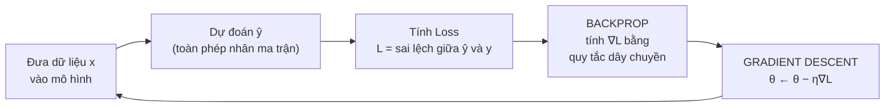

# 2. Giải tích (Calculus) — Đạo hàm, Tích phân & Gradient Descent

> 🎓 **NCKH** / [Toán](../toan/index.md) / **Giải tích**

> 🎯 **Câu hỏi lớn của cả trang:** *Làm sao một cỗ máy có hàng triệu con số lại có thể "tự học" để tốt dần lên?*
> Câu trả lời nằm trọn trong một câu: **đạo hàm cho biết đi hướng nào thì sai số giảm, và ta cứ đi theo hướng đó hàng triệu lần.** Đó chính là **Gradient Descent**.
> Nếu [Đại số tuyến tính](dai-so-tuyen-tinh.md) trả lời câu hỏi *"AI TÍNH như thế nào"*, thì Giải tích trả lời câu hỏi *"AI HỌC như thế nào"*.

---

# 1. Bản chất của đạo hàm

Ở trường, đạo hàm thường được dạy như một **bảng công thức phải thuộc lòng**. Nhưng bản chất của nó chỉ là một câu hỏi rất đời thường:

> ❓ **"Nếu tôi nhích đầu vào một xíu, thì đầu ra thay đổi bao nhiêu?"**
> Đạo hàm KHÔNG phải là giá trị của hàm số. Nó là **tốc độ thay đổi** của hàm số — hay nói theo hình học, là **độ dốc của đồ thị tại một điểm**.

## Phát biểu chính xác

$$
f'(x) = \lim_{h \to 0} \frac{f(x+h) - f(x)}{h}
$$

Phần tử số là **đầu ra thay đổi bao nhiêu**, phần mẫu số là **đầu vào thay đổi bao nhiêu**. Chia hai cái cho nhau ta được tỉ lệ đổi — tức độ dốc. Chữ $h \to 0$ nghĩa là **nhích thật nhỏ**, nhỏ tới mức ta đang đo độ dốc **tại đúng một điểm** chứ không phải trên một đoạn.

## Tự kiểm chứng bằng số

Lấy $f(x) = x^2$ và hỏi: độ dốc tại $x = 3$ là bao nhiêu? Thay vì dùng công thức, ta **bấm máy tính với h nhỏ dần**:

| h | $f(3+h)$ | $\dfrac{f(3+h) - f(3)}{h}$ | Kết quả |
|---|---|---|---|
| 1 | $4^2 = 16$ | (16 − 9) / 1 | 7 |
| 0.1 | $3.1^2 = 9.61$ | (9.61 − 9) / 0.1 | 6.1 |
| 0.01 | $3.01^2 = 9.0601$ | (9.0601 − 9) / 0.01 | 6.01 |
| 0.001 | $3.001^2 = 9.006001$ | (9.006001 − 9) / 0.001 | 6.001 |
| $\to 0$ | — | — | **6** |

> ✅ Dãy số hội tụ về **6**. Và công thức $(x^2)' = 2x$ cho $2 \times 3 = 6$ — khớp.
> **Điều đáng nhớ:** công thức ở trường chỉ là **lối tắt** cho phép bấm máy ở trên. Bản chất luôn là "nhích một xíu rồi xem đầu ra đổi bao nhiêu".

## Đọc ý nghĩa của đạo hàm

| Giá trị $f'(x)$ | Nghĩa là | Để giảm f, ta nên |
|---|---|---|
| $f'(x) = +6$ | Đang **lên dốc**, tăng x thì f tăng nhanh | **Giảm x** |
| $f'(x) = -6$ | Đang **xuống dốc**, tăng x thì f giảm | **Tăng x** |
| $f'(x) = +0.01$ | Gần như phẳng, sắp tới đáy | Đi bước rất nhỏ |
| $f'(x) = 0$ | **Đáy (hoặc đỉnh)** — hoàn toàn phẳng | **Dừng lại** |

> 🔑 Cột cuối cùng chính là **toàn bộ thuật toán học của AI**, phát biểu bằng lời: *luôn đi ngược dấu của đạo hàm.* Phần còn lại chỉ là chi tiết kỹ thuật.

---

# 2. Quy tắc dây chuyền (Chain Rule) — quy tắc quan trọng nhất

Trong tất cả các quy tắc đạo hàm, đây là quy tắc **duy nhất bắt buộc phải hiểu thật kỹ**, vì nó chính là Backpropagation.

$$
\frac{dy}{dx} = \frac{dy}{du} \cdot \frac{du}{dx}
$$

> ⚙️ **Trực giác — hệ bánh răng:** bánh A quay nhanh gấp **3** lần bánh B, bánh B quay nhanh gấp **2** lần bánh C. Vậy A nhanh gấp mấy lần C? **3 × 2 = 6**.
> Chain rule chỉ nói đúng điều đó: khi các đại lượng nối tiếp nhau, **tốc độ ảnh hưởng được NHÂN dồn qua từng khâu**.

**Ví dụ tính tay.** Cho $y = (3x + 1)^2$. Đặt $u = 3x+1$, ta có $y = u^2$.

$$
\frac{dy}{du} = 2u, \qquad \frac{du}{dx} = 3 \qquad \Rightarrow \qquad \frac{dy}{dx} = 2u \cdot 3 = 6(3x+1)
$$

Tại $x = 1$: $\frac{dy}{dx} = 6(4) = 24$. Kiểm chứng bằng cách nhích một xíu: $f(1) = 16$, $f(1.001) = 4.003^2 = 16.024009$, chia cho 0.001 được **24.009** — đúng.

> 🧠 **Vì sao đây là Backpropagation:** một mạng nơ-ron 100 lớp thực chất là 100 hàm lồng nhau, $f_{100}(f_{99}(\dots f_1(x)))$. Muốn biết trọng số ở **lớp 1** ảnh hưởng thế nào tới sai số ở **lớp 100**, ta chỉ việc **nhân dồn 100 đạo hàm** lại với nhau — đúng quy tắc bánh răng ở trên.
> Đây cũng là lý do có hiện tượng **vanishing gradient**: nếu mỗi khâu nhân với một số nhỏ hơn 1, nhân dồn 100 lần thì kết quả teo về gần 0, và các lớp đầu gần như không học được gì.

---

# 3. Bản chất của tích phân

Nếu đạo hàm là **chia nhỏ ra để xem tốc độ**, thì tích phân là chiều ngược lại: **gom vô số mảnh nhỏ lại thành một tổng**.

> ❓ **"Nếu tôi biết tốc độ thay đổi ở mọi thời điểm, thì tổng cộng đã tích lũy được bao nhiêu?"**
> Về hình học: tích phân là **diện tích nằm dưới đường cong**.

## Ý tưởng: chia thành hình chữ nhật rồi cộng lại

Muốn tính diện tích dưới đường $f(x) = x$ từ 0 đến 2, ta chia đoạn đó thành n hình chữ nhật, tính diện tích từng cái rồi cộng — càng nhiều hình chữ nhật thì càng chính xác:

| Số hình chữ nhật | Chiều rộng mỗi cái | Tổng diện tích | Sai lệch so với đáp án đúng |
|---|---|---|---|
| 4 | 0.5 | 2.5 | +0.5 |
| 8 | 0.25 | 2.25 | +0.25 |
| 16 | 0.125 | 2.125 | +0.125 |
| 100 | 0.02 | 2.02 | +0.02 |
| **vô hạn** | **→ 0** | **2** | **0** |

$$
\int_0^2 x \, dx = \left. \frac{x^2}{2} \right|_0^2 = \frac{4}{2} - 0 = 2 \quad \checkmark
$$

> 📐 **Kiểm tra lại bằng hình học lớp 6:** vùng dưới đường $y = x$ từ 0 đến 2 là một **tam giác vuông** có đáy 2 và cao 2. Diện tích $= \frac{1}{2} \times 2 \times 2 = 2$. Khớp.
> Tích phân **không phải phép thuật** — nó chỉ là cách tính diện tích cho những hình mà công thức hình học phổ thông chịu thua.
> Ký hiệu $\int$ thực ra là **chữ S kéo dài** của từ "Sum" (tổng), và $dx$ là **chiều rộng bé xíu** của mỗi hình chữ nhật. Đọc công thức theo nghĩa đó thì nó chỉ nói: *"cộng tất cả (chiều cao × chiều rộng) lại"*.

## Đạo hàm và Tích phân là hai chiều ngược nhau

Đây là **Định lý cơ bản của Giải tích** — kết quả quan trọng nhất của cả môn học:

$$
\frac{d}{dx}\left( \int_a^x f(t)\, dt \right) = f(x)
$$

| | Đạo hàm | Tích phân |
|---|---|---|
| Làm gì | **Chia nhỏ** để xem tốc độ tại một điểm | **Gom lại** để xem tổng tích lũy |
| Ví dụ đời thường | Từ **quãng đường** ra **vận tốc** | Từ **vận tốc** ra **quãng đường** |
| Hình học | Độ dốc của tiếp tuyến | Diện tích dưới đường cong |
| Trong AI | **Huấn luyện** (Gradient Descent, Backprop) | **Xác suất** (kỳ vọng, ELBO, chuẩn hóa) |

## Tích phân xuất hiện ở đâu trong AI?

Đạo hàm thì bạn gặp mỗi ngày khi train. Tích phân ít lộ diện hơn, nhưng nó nằm ngay dưới nền của mọi mô hình xác suất:

| Chỗ xuất hiện | Công thức | Ý nghĩa |
|---|---|---|
| **Kỳ vọng (Expectation)** | $\mathbb{E}[X] = \int x \, p(x) \, dx$ | Giá trị trung bình có trọng số theo xác suất — xuất hiện trong mọi hàm Loss |
| **Chuẩn hóa xác suất** | $\int p(x)\,dx = 1$ | Điều kiện để một hàm được gọi là phân phối xác suất |
| **Bài toán gốc của VAE** | $p(x) = \int p(x\vert z)\, p(z) \, dz$ | Tích phân này **không tính nổi** (intractable) — chính vì vậy mới phải phát minh ra ELBO |
| **KL Divergence** | $D_{KL} = \int q(z) \log \frac{q(z)}{p(z)} dz$ | Thành phần thứ hai trong hàm Loss của VAE |
| **Diffusion Model** | Tích phân theo thời gian của quá trình khuếch tán | Nền toán của Stable Diffusion |

> 🔗 **Đây là điểm nối trực tiếp với đề tài của bạn.** Dòng thứ ba trong bảng — tích phân không tính nổi — chính là câu mở đầu của mục 2 trong [VAE](../deep-learning/vae.md). Chữ **"Variational"** trong tên VAE ra đời **chỉ vì** người ta không tính được tích phân đó và phải đi đường vòng.
> Nói cách khác: hiểu tích phân là gì thì mới hiểu **vì sao VAE tồn tại**.

---

# 4. Từ đạo hàm một biến sang Gradient nhiều biến

Hàm Loss của một mạng nơ-ron không phụ thuộc vào **một** biến, mà vào **hàng triệu** trọng số. Khi đó ta cần khái niệm mở rộng.

**Đạo hàm riêng** $\frac{\partial f}{\partial x}$ nghĩa là: đạo hàm theo x, **coi mọi biến còn lại như hằng số**. Không có gì mới — vẫn là "nhích x một xíu, xem f đổi bao nhiêu", chỉ khác là ta giữ yên các biến kia.

**Gradient** là **vector gom tất cả các đạo hàm riêng lại**:

$$
\nabla f = \left[ \frac{\partial f}{\partial x_1}, \frac{\partial f}{\partial x_2}, \dots, \frac{\partial f}{\partial x_n} \right]
$$

## Ví dụ cụ thể

Cho $f(x, y) = x^2 + 3y^2$. Ta có $\frac{\partial f}{\partial x} = 2x$ và $\frac{\partial f}{\partial y} = 6y$.

Tại điểm $(1, 2)$:

$$
\nabla f(1,2) = [\,2,\; 12\,]
$$

> 🧭 **Cách đọc vector này — hai thông tin trong một:**
> **Hướng:** $[2, 12]$ chỉ về phía **dốc lên nhanh nhất**. Muốn *giảm* f thì đi ngược lại, tức hướng $[-2, -12]$.
> **Độ lớn:** thành phần y là **12**, gấp 6 lần thành phần x là **2**. Nghĩa là ở điểm này, hàm số **nhạy với y gấp 6 lần so với x** — nhích y một chút thì f đổi nhiều hơn hẳn.
> Hình dung: bạn đứng trên sườn đồi trong sương mù. Gradient là chiếc la bàn chỉ **hướng dốc nhất**, và độ dài kim cho biết **dốc tới mức nào**.

---

# 5. Gradient Descent — thuật toán dạy mọi AI cách học

Ghép hai ý lại: gradient chỉ hướng dốc lên, và ta muốn **xuống đáy** (Loss nhỏ nhất). Vậy cứ **đi ngược gradient**, lặp đi lặp lại.

$$
\theta_{\text{mới}} = \theta_{\text{cũ}} - \eta \cdot \nabla L(\theta)
$$

| Ký hiệu | Là gì | Trong thực tế |
|---|---|---|
| $\theta$ | Toàn bộ trọng số của mô hình | Có thể là hàng tỉ con số |
| $L(\theta)$ | Hàm mất mát — mức độ sai | MSE, BCE, CrossEntropy... |
| $\nabla L$ | Gradient — hướng làm sai **nhiều hơn** | Tính bằng Backpropagation |
| **dấu trừ** | **Đi NGƯỢC lại** hướng đó | Đây là chữ "Descent" (đi xuống) |
| $\eta$ | Learning rate — bước chân dài bao nhiêu | Thường 0.001 – 0.1 |

## Chạy tay thuật toán

Bài toán đơn giản nhất: tìm x để $f(x) = x^2$ nhỏ nhất (ai cũng biết đáp án là **x = 0**). Ta có $f'(x) = 2x$. Bắt đầu từ $x = 4$, learning rate $\eta = 0.1$:

| Bước | x hiện tại | $f(x)$ | $f'(x) = 2x$ | Tính $x - 0.1 \times f'(x)$ | x mới |
|---|---|---|---|---|---|
| 0 | 4.000 | 16.00 | 8.00 | 4 − 0.8 | 3.200 |
| 1 | 3.200 | 10.24 | 6.40 | 3.2 − 0.64 | 2.560 |
| 2 | 2.560 | 6.55 | 5.12 | 2.56 − 0.512 | 2.048 |
| 3 | 2.048 | 4.19 | 4.10 | 2.048 − 0.410 | 1.638 |
| 4 | 1.638 | 2.68 | 3.28 | 1.638 − 0.328 | 1.311 |
| ... | ... | ... | ... | ... | ... |
| 50 | ≈ 0.000 | ≈ 0 | ≈ 0 | gần như không đổi | **≈ 0** ✓ |

> 👀 **Ba điều nhìn ra ngay từ bảng:**
> 1. **f(x) giảm đều đặn:** 16 → 10.24 → 6.55 → 4.19 → 2.68. Mô hình đang "học".
> 2. **Bước chân tự động ngắn lại:** 0.8 → 0.64 → 0.512 → 0.41. Vì càng gần đáy thì độ dốc càng nhỏ, mà bước chân tỉ lệ với độ dốc. **Không ai lập trình điều này cả — nó tự xảy ra.**
> 3. **Không bao giờ chạm đúng 0**, chỉ tiến gần vô hạn. Nên trong thực tế ta dừng khi Loss đã đủ nhỏ hoặc hết số epoch.
> Toàn bộ việc huấn luyện một mô hình hàng tỉ tham số **chỉ là bảng này**, lặp lại hàng triệu lần, trên hàng tỉ chiều thay vì một chiều.

## Learning rate — con số làm hỏng mọi thứ nếu chọn sai

Vẫn bài toán trên, xuất phát từ x = 4, chỉ đổi mỗi $\eta$:

| $\eta$ | Diễn biến | Kết quả |
|---|---|---|
| **0.001** (quá nhỏ) | 4 → 3.992 → 3.984 → ... | Đúng hướng nhưng **chậm kinh khủng**, cần hàng chục nghìn bước |
| **0.1** (vừa) | 4 → 3.2 → 2.56 → 2.05 | **Hội tụ mượt** — như bảng trên |
| **0.9** (hơi lớn) | 4 → −3.2 → 2.56 → −2.05 | Nhảy qua nhảy lại hai bên đáy, nhưng biên độ vẫn co dần |
| **1.1** (quá lớn) | 4 → **−4.8** → **5.76** → **−6.91** | **Phân kỳ** — càng đi càng xa đáy, Loss phình lên rồi thành `NaN` |

> ⚠️ Hàng cuối là hiện tượng bạn sẽ gặp trong thực tế: Loss đang giảm rồi đột nhiên nhảy vọt lên hoặc biến thành `NaN`. **Phản xạ đầu tiên phải là giảm learning rate xuống 10 lần.**
> Hình dung: bạn muốn xuống đáy thung lũng nhưng mỗi bước lại sải quá dài, nên cứ nhảy từ sườn bên này sang sườn bên kia và ngày càng lên cao.

## Ba biến thể trong thực tế

| Tên | Mỗi bước dùng bao nhiêu dữ liệu | Đặc điểm |
|---|---|---|
| **Batch GD** | **Toàn bộ** tập dữ liệu | Hướng đi chính xác nhất nhưng cực chậm, không khả thi với dữ liệu lớn |
| **SGD** | **Một** mẫu | Rất nhanh nhưng đường đi ngoằn ngoèo; nhiễu đó đôi khi lại giúp thoát cực tiểu địa phương |
| **Mini-batch GD** | Một lô (32 – 256 mẫu) | **Lựa chọn mặc định trong mọi thư viện** — cân bằng giữa hai cái trên. Đây chính là ý nghĩa của siêu tham số `batch_size` |

> 🚀 **Adam — thứ bạn thực sự dùng khi viết code.** Adam vẫn là Gradient Descent, nhưng thêm hai cải tiến: **momentum** (nhớ hướng đi các bước trước, như hòn bi lăn có quán tính nên vượt qua được chỗ gồ ghề) và **learning rate riêng cho từng tham số** (tham số nào ít được cập nhật thì cho bước dài hơn).
> Vì vậy dòng `optimizer = torch.optim.Adam(model.parameters(), lr=1e-3)` mà bạn viết trong mọi bài thực hành chính là **công thức ở đầu mục 5**, chỉ được gia cố thêm.

---

# 6. Ghép tất cả lại: một vòng lặp huấn luyện



| Dòng code PyTorch | Thực chất là bước nào | Kiến thức toán đứng sau |
|---|---|---|
| `y_hat = model(x)` | Lan truyền xuôi | **Đại số tuyến tính** — nhân ma trận |
| `loss = criterion(y_hat, y)` | Đo mức độ sai | Hàm mất mát |
| `optimizer.zero_grad()` | Xóa gradient của bước trước | (PyTorch cộng dồn gradient nếu không xóa) |
| **`loss.backward()`** | Tính toàn bộ $\nabla L$ | **Quy tắc dây chuyền** — mục 2 |
| **`optimizer.step()`** | Cập nhật trọng số | **Gradient Descent** — mục 5 |

> 🎓 **Nhìn bảng này là thấy toàn bộ mối liên hệ giữa hai trang Toán:**
> `model(x)` là **Đại số tuyến tính**. `loss.backward()` và `optimizer.step()` là **Giải tích**.
> Một mô hình AI = đại số tuyến tính để **tính**, giải tích để **học**. Không có gì hơn thế.

## Ba cái bẫy của bề mặt Loss

> 🕳️ **Cực tiểu địa phương**
> Một cái hố nhỏ không phải đáy thật. Gradient bằng 0 nên thuật toán tưởng đã xong.
> Trong không gian nhiều chiều, chuyện này **hiếm hơn ta tưởng** — để bị kẹt thì phải mọi chiều đều đi lên cùng lúc.

> 🐴 **Điểm yên ngựa (saddle point)**
> Chiều này đi lên, chiều kia đi xuống, gradient vẫn bằng 0. **Đây mới là vấn đề thật sự** trong mạng lớn, không phải cực tiểu địa phương.
> Momentum giúp trượt qua được.

> 🏔️ **Cao nguyên phẳng (plateau)**
> Gradient gần bằng 0 trên một vùng rộng, mô hình gần như đứng yên rất lâu.
> Liên quan tới **vanishing gradient** và là lý do có Batch Normalization, residual connection.

---

# 7. Tự chạy lại toàn bộ trang này bằng 12 dòng code

```python
import torch

# f(x) = x^2, tim x de f nho nhat
x = torch.tensor([4.0], requires_grad=True)   # diem xuat phat
lr = 0.1

for step in range(5):
    loss = x ** 2                 # ham mat mat
    loss.backward()               # <- CHAIN RULE: tinh dao ham, ra 2x
    with torch.no_grad():
        x -= lr * x.grad          # <- GRADIENT DESCENT: di nguoc gradient
    print(f"buoc {step}: x = {x.item():.3f}, f(x) = {loss.item():.2f}, grad = {x.grad.item():.2f}")
    x.grad.zero_()                # xoa gradient cho buoc sau
```

> ✅ Chạy đoạn này và **đối chiếu output với bảng ở mục 5** — bạn sẽ thấy đúng dãy 4.000 → 3.200 → 2.560 → 2.048 → 1.638.
> Sau đó thử đổi `lr = 1.1` và xem nó phân kỳ đúng như bảng learning rate. Mười lăm phút này đáng giá hơn đọc lý thuyết cả buổi.

---

# 8. Bảng thuật ngữ nhanh

| Thuật ngữ | Hiểu trong một câu |
|---|---|
| **Derivative** (đạo hàm) | Nhích đầu vào một xíu thì đầu ra đổi bao nhiêu — độ dốc tại một điểm |
| **Partial derivative** (đạo hàm riêng) | Đạo hàm theo một biến, coi các biến còn lại là hằng số |
| **Gradient** | Vector gom mọi đạo hàm riêng — chỉ hướng dốc lên nhanh nhất |
| **Chain Rule** | Đạo hàm của hàm lồng nhau = tích các đạo hàm từng khâu. Chính là Backpropagation |
| **Integral** (tích phân) | Gom vô số mảnh nhỏ thành một tổng — diện tích dưới đường cong |
| **Gradient Descent** | Lặp lại việc đi ngược hướng gradient để giảm dần hàm mất mát |
| **Learning rate** $\eta$ | Độ dài mỗi bước chân. Quá nhỏ thì chậm, quá lớn thì phân kỳ |
| **Convergence** (hội tụ) | Loss đã giảm tới mức gần như không đổi nữa |
| **Local minimum / Saddle point** | Chỗ gradient bằng 0 nhưng chưa phải đáy thật |
| **Jacobian** | Ma trận chứa mọi đạo hàm riêng khi cả đầu vào lẫn đầu ra đều là vector |
| **Hessian** | Ma trận đạo hàm bậc hai — cho biết độ cong, dùng trong các phương pháp tối ưu bậc cao |

---

# 9. Nguồn học

## Video đã xem

- [Thuật Toán Dạy Mọi AI Cách Học \| Gradient Descent — Học Giải Thuật Cùng HPN](https://youtu.be/w_Rk7JgjDno) — **video gốc của trang này**, giải thích bằng tiếng Việt cơ chế học của mọi mô hình AI.

## Nên xem tiếp

- [Essence of Calculus — 3Blue1Brown (toàn bộ series)](https://www.youtube.com/playlist?list=PLZHQObOWTQDMsr9K-rj53DwVRMYO3t5Yr) — **nguồn tốt nhất cho phần trực giác**. Tập 1 dựng lại toàn bộ giải tích chỉ từ bài toán tính diện tích hình tròn; tập 4 giải thích chain rule bằng hình động.
- [Gradient descent, how neural networks learn — 3Blue1Brown (Chương 2 series Deep Learning)](https://www.youtube.com/watch?v=IHZwWFHWa-w) — hình dung bề mặt Loss và hòn bi lăn xuống đáy.
- [Backpropagation calculus — 3Blue1Brown (Chương 4)](https://www.youtube.com/watch?v=tIeHLnjs5U8) — nối thẳng chain rule với việc cập nhật trọng số.
- [Mathematics for Machine Learning — Deisenroth, Faisal, Ong (PDF miễn phí)](https://mml-book.github.io/) — **sách để trích dẫn trong bài báo**. Chương 5 là Vector Calculus, chương 7 là Optimization.
- [CS231n — Optimization Notes (Stanford)](https://cs231n.github.io/optimization-1/) — giải thích Gradient Descent theo góc nhìn kỹ sư, có code.
- [Deep Learning Book — Chapter 4: Numerical Computation (Goodfellow et al.)](https://www.deeplearningbook.org/contents/numerical.html) — phần tối ưu hóa dựa trên gradient, viết chặt chẽ.

> 🧭 **Thứ tự mình khuyên:** xem lại video HPN → chạy đoạn code 12 dòng ở mục 7 và đối chiếu với bảng ở mục 5 → xem tập 1 và tập 4 của Essence of Calculus → cuối cùng xem chương 2 và 4 của series Deep Learning (3Blue1Brown).
> Sau bốn bước đó, khi bạn viết `loss.backward()` bạn sẽ biết chính xác dòng đó đang làm gì.

---

# 10. Ghi chú của mình

*(Điền sau khi học: chỗ nào còn vướng, câu hỏi cần hỏi thầy.)*
