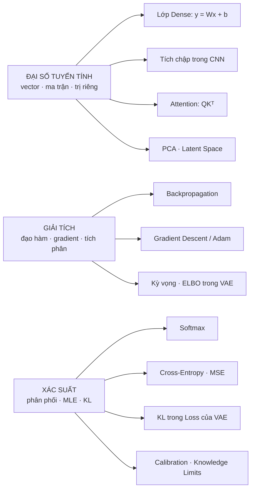

# Toán nền tảng

Trong ghi chú này sẽ bao gồm các kiến thức nền về toán học giải thích bản chất của các dạng toán được ứng dụng trong ngành AI hiện nay. Các bài toán cơ bản như Đại số tuyến tính, Giải tích,… Lưu ý đây không phải là một bài ghi chú hướng dẫn giải các bài toán để tự giải các bài tập khó hoặc tương tự, ghi chú này đi vào **giải thích bản chất** của các lĩnh vực toán đang được giảng dạy hiện nay.

---

## Ba trụ cột

- **1. Đại số tuyến tính** — Vector, ma trận, định thức, trị riêng. Trả lời câu hỏi: **AI TÍNH bằng cách nào?**
  → [1. Đại số tuyến tính (Linear Algebra)](dai-so-tuyen-tinh.md)
- **2. Giải tích** — Đạo hàm, tích phân, gradient, Gradient Descent. Trả lời câu hỏi: **AI HỌC bằng cách nào?**
  → [2. Giải tích (Calculus) — Đạo hàm, Tích phân & Gradient Descent](giai-tich.md)
- **3. Xác suất & Thống kê** — Phân phối, Bayes, MLE, Entropy, KL. Trả lời câu hỏi: **AI biểu diễn SỰ KHÔNG CHẮC CHẮN bằng cách nào?**
  → [3. Xác suất & Thống kê (Probability & Statistics)](xac-suat-thong-ke.md)

## Bản đồ: mỗi mảng toán đi vào chỗ nào của AI

> **🎯 Một dòng code PyTorch chạm vào cả ba trụ cột:**
> `y_hat = model(x)` → **Đại số tuyến tính** (chuỗi phép nhân ma trận)
> `loss = criterion(y_hat, y)` → **Xác suất** (Cross-Entropy chính là MLE viết lại)
> `loss.backward()` và `optimizer.step()` → **Giải tích** (quy tắc dây chuyền và Gradient Descent)
> Hiểu ba trang con dưới đây là hiểu được **toàn bộ nền toán** của một mô hình học sâu.

## Nên học theo thứ tự nào?

| Ưu tiên | Học phần nào | Vì sao học trước |
|---|---|---|
| **1** | Đại số tuyến tính | Không đọc nổi bất kỳ công thức nào nếu chưa quen ký hiệu vector và ma trận |
| **2** | Giải tích (tới hết Gradient Descent) | Để hiểu vì sao mô hình học được, và vì sao learning rate lại quan trọng |
| **3** | Xác suất (tới hết Cross-Entropy) | Để hiểu bản chất của hàm mất mát |
| **4** | Xác suất (KL Divergence, ELBO) + Tích phân | Học ngay trước khi đọc kỹ **Variational Autoencoder (VAE)** |

> **📖 Một cuốn sách cho cả ba phần:** [Mathematics for Machine Learning — Deisenroth, Faisal & Ong](https://mml-book.github.io/) (PDF miễn phí). Chương 2–4 là đại số tuyến tính, chương 5 và 7 là giải tích và tối ưu hóa, chương 6 là xác suất. Đây cũng là nguồn nên trích dẫn khi viết bài báo.
> **Một kênh cho phần trực giác:** [3Blue1Brown](https://www.3blue1brown.com/) — hai series *Essence of Linear Algebra* và *Essence of Calculus*.
